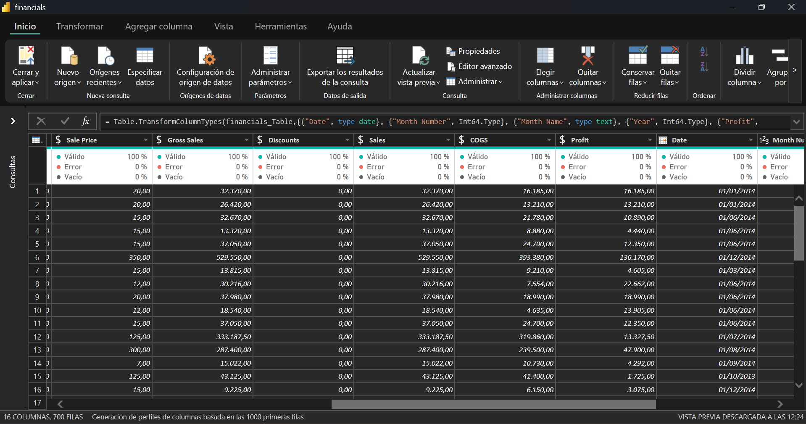
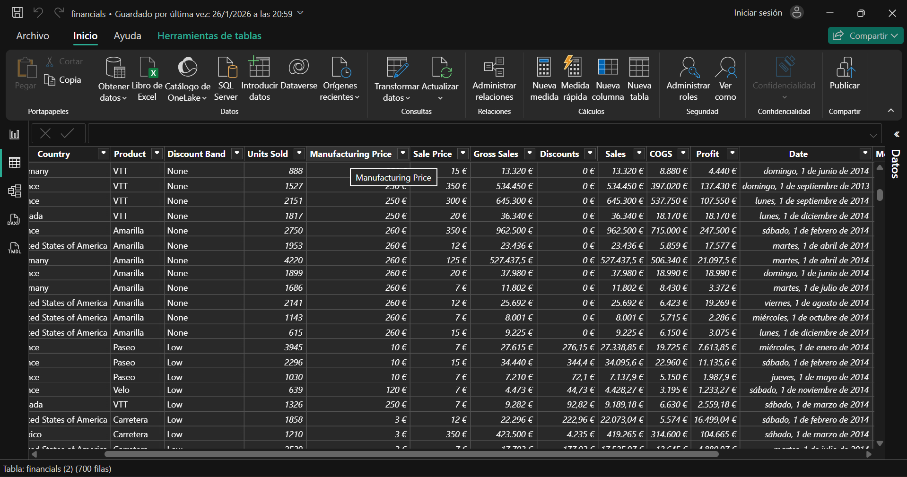
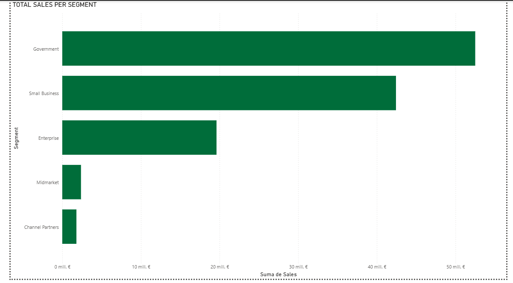
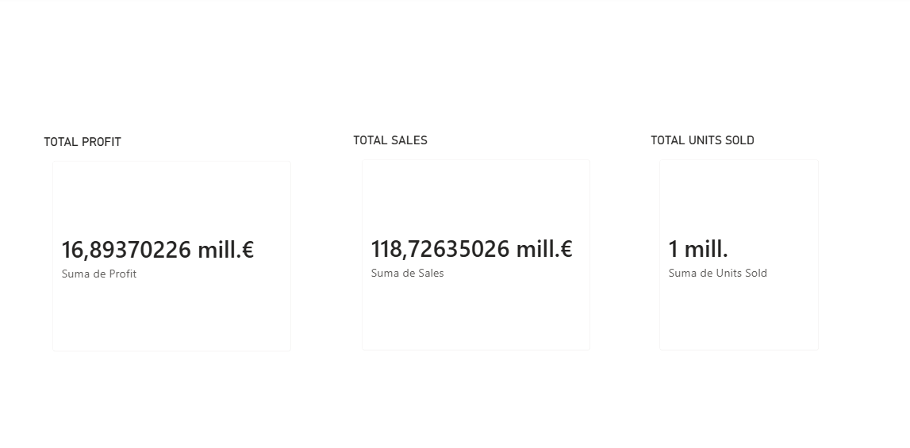
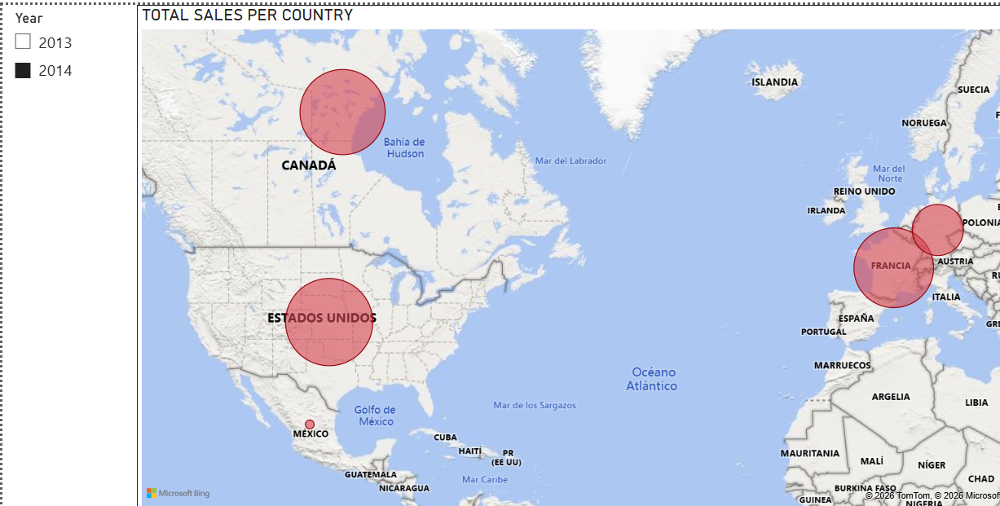
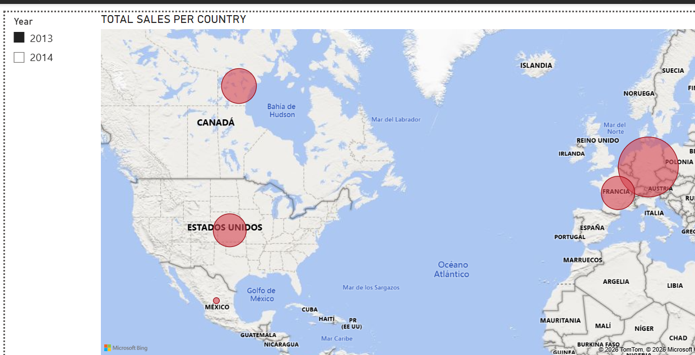
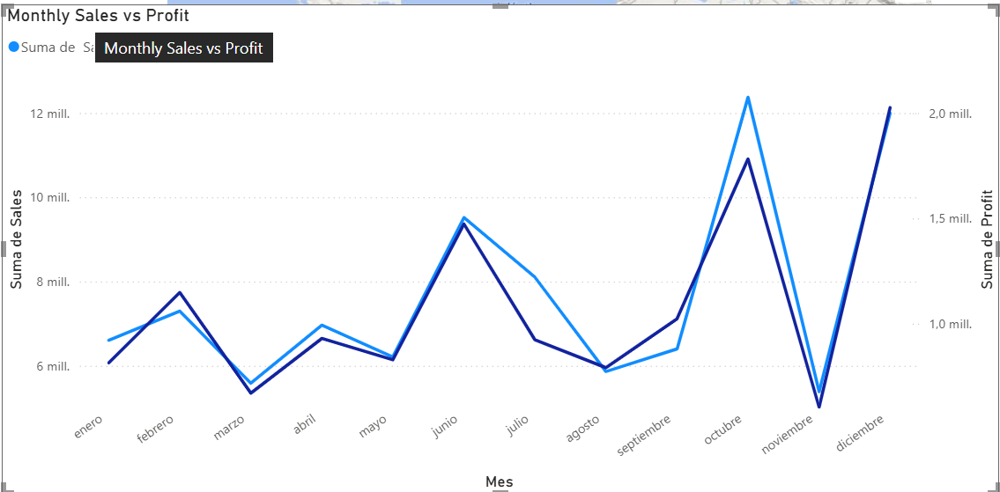
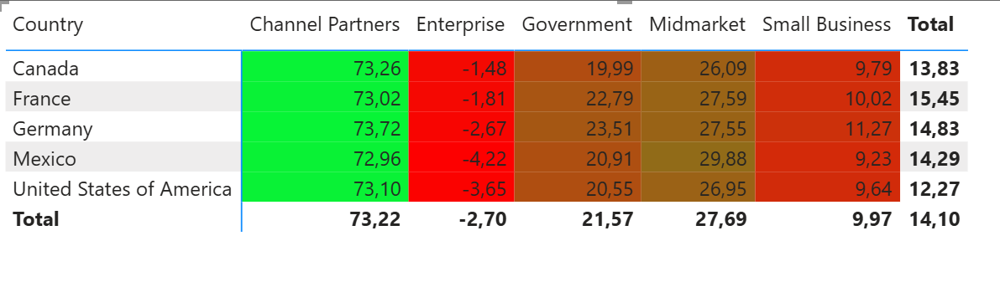
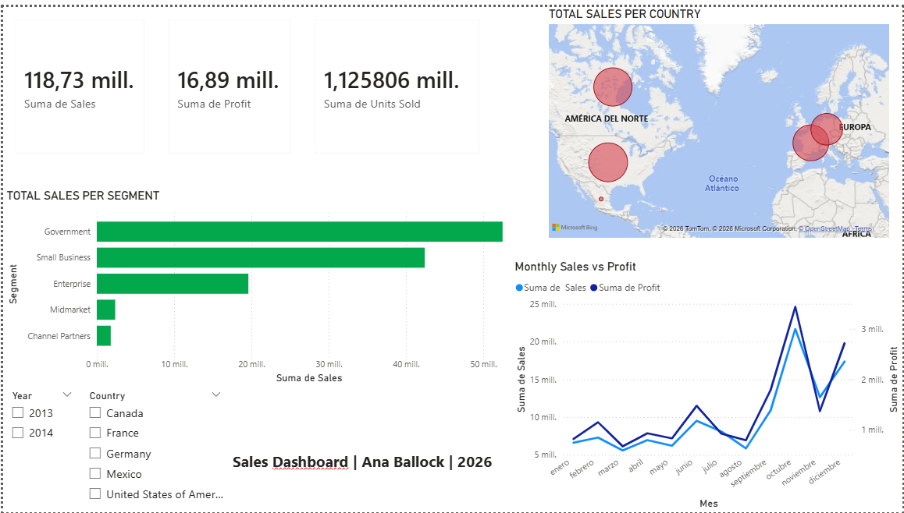
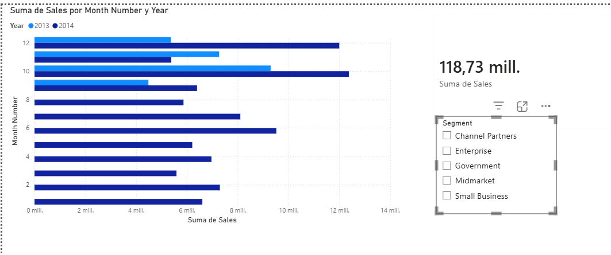

**Author:** Ana Ballock | [LinkedIn](linkedin.com/in/anaballock) | [GitHub](github.com/apballock)

# Financial Sample – Power BI Data Exploration

## Level 1
### Exercise 1 - Dataset Overview

- **Source:** Power BI Sample Dataset (Financial Sample)
- **Rows:** 700
- **Columns:** 16

---

## Column Description

The dataset contains financial sales data with the following columns:

- **Segment** – Customer segment (Consumer, Corporate, Home Office)
- **Country** – Country of the sale
- **Product** – Product sold
- **Discount Band** – Discount category applied
- **Units Sold** – Quantity of units sold
- **Manufacturing Price** – Production cost per unit
- **Sale Price** – Selling price per unit
- **Gross Sales** – Total sales before discounts
- **Discounts** – Discount amount applied
- **Sales** – Net sales after discounts
- **COGS** – Cost of Goods Sold
- **Profit** – Profit generated
- **Date** – Transaction date
- **Month Number** – Numeric month (1–12)
- **Month Name** – Month name
- **Year** – Year of transaction

---

## Data Quality Assessment (Power Query)

The dataset was loaded into Power Query Editor for inspection and cleaning.

### Missing Values
- No null values were identified in the dataset.

### Data Type Validation & Fixes

The following data type corrections were applied:

- `Date` → Date
- `Year` → Whole Number (Integer)
- `Units Sold` → Whole Number
- Financial fields (`Sales`, `Profit`, `COGS`, `Manufacturing Price`, `Discounts`) → Fixed Decimal Number (currency)

---

## Data Transformations

- Standardized column data types for consistency
- Ensured numerical fields are properly formatted for calculations
- Verified dataset integrity before analysis

---

## Summary

The dataset contains **700 rows and 16 columns** representing financial sales transactions. After inspection in Power Query, no missing values were found, and all columns were standardized to appropriate data types, ensuring the dataset is ready for further analysis and visualization in Power BI.

---

## Screenshots




---

## Exercise 2 - First Visualization: Sales by Segment

### Objective

Create a bar chart to analyze total sales by customer segment.

---

## Visualization Created

A **Clustered Bar Chart** was created in Power BI to visualize total sales per segment.

### Configuration:
- **Y-Axis:** Segment  
- **X-Axis:** Sales (aggregated as Sum)  

Additional formatting:
- Bars sorted in descending order (highest to lowest sales)
- Chart title: *"Total Sales by Segment"*
- Custom bar color applied (non-default blue) for better visual clarity

---

## Business Insight

### Which segment has the highest total sales?
- **Government segment** shows the highest total sales.

### Which segment has the lowest total sales?
- **Channel Partners segment** has the lowest total sales.

---

## Key Takeaway

The analysis shows a strong concentration of revenue in the Government segment, indicating it is the primary driver of sales performance in this dataset. In contrast, Channel Partners contribute the least to total sales, suggesting a potential area for growth or strategic review.

---

## Screenshots


---

## Exercise 3 - KPI Cards

### Objective

Create KPI summary cards to highlight the main business metrics in the dashboard header.

---

## KPI Visuals Created

Three **Card visuals** were added to the report page:

### KPIs:
- **Total Sales**
- **Total Profit**
- **Total Units Sold**

### Configuration:
- Added descriptive titles to each KPI card
- Adjusted font sizes for better readability
- Aligned all cards horizontally across the top of the report page
- Renamed the report page to **"Overview"**

---

## KPI Summary

### Total Sales
- **Total Sales:** `118,72635026 mill. €`

### Overall Profit
- **Total Profit:** `16,89370226 mill. €`

### Total Units Sold
- **Units Sold:** `1 mill.`

---

## Key Takeaway

The KPI cards provide a quick overview of the dataset’s overall business performance, allowing users to immediately identify revenue, profitability, and sales volume at a glance.

---

## Screenshots


---

## Level 2 - Data Modeling & DAX Measures  
### Exercise 1 - Sales by Country on a Map

###  Objective

Visualize the geographic distribution of sales using a map visual and interactive filtering.

---

## Visualization Created

A **Map visual** was added to display total sales by country.

### Configuration:
- **Location:** Country
- **Bubble Size:** Sales

To enable geographic visuals, map visuals were activated in:

`File → Options → Security → Enable Map Visuals`

---

## Interactive Filter

A **Slicer visual** was added next to the map to filter data dynamically by year.

### Slicer Configuration:
- **Field:** Year

The slicer was tested successfully by selecting different years and confirming that the map updated interactively.

---

## Business Insight

### Which country has the highest total sales?
- **United States** has the highest total sales in the dataset.

### Does the ranking change between years?
- The overall ranking remains relatively consistent across years, although some countries show variations in sales volume depending on the selected year.

---

## Key Takeaway

The map visualization provides a clear geographic overview of sales performance across countries. Adding the Year slicer improves interactivity and allows users to analyze trends and regional performance over time.

---

## Screenshots




---
 
### Exercise 2 - Monthly Sales Trend (Time Series)

### Objective

Analyze how sales and profit evolved over time using a time series visualization.

---

## Visualization Created

A **Line Chart** was created to compare monthly Sales and Profit trends over time.

### Configuration:
- **X-Axis:** Date (Month level only)
- **Y-Axis:** Sales
- **Secondary Y-Axis:** Profit
- **Legend:** Enabled to distinguish Sales and Profit lines
- **Chart Title:** *"Monthly Sales vs Profit"*

The Date hierarchy generated by Power BI was adjusted to display only the **Month** level, allowing a clearer month-by-month comparison instead of daily granularity.

---

## Business Insight

### Which month had the highest sales?
- **December** shows the highest sales performance in the dataset.

### Is there a seasonal pattern?
- Yes. The visualization suggests a seasonal sales pattern, with sales and profit increasing toward the end of the year. Higher performance is visible during the last months, especially in Q4, indicating stronger year-end business activity.

---

## Key Takeaway

The time series analysis highlights monthly fluctuations in both sales and profit, making it easier to identify trends, seasonality, and periods of stronger business performance. Comparing both measures in a single chart also helps evaluate profitability alongside revenue growth.

---

## Screenshots


---

### Exercise 3 - First DAX Measures

### Objective

Create calculated measures using DAX and analyze profitability across countries and customer segments using a Matrix visual.

---

## DAX Measures Created

The following DAX measures were created using **New Measure** in Power BI:

### Profit Margin %

```DAX
Profit Margin % =
DIVIDE(SUM('financials'[Profit]), SUM('financials'[Sales])) * 100
```

### Avg Sale per Unit

```DAX
Avg Sale per Unit =
DIVIDE(SUM('financials'[Sales]), SUM('financials'[Units Sold]))
```

### Total COGS

```DAX
Total COGS =
SUM('financials'[COGS])
```

---

## Matrix Visualization

A **Matrix visual** was created to compare profit margins across countries and customer segments.

### Configuration:
- **Rows:** Country
- **Columns:** Segment
- **Values:** Profit Margin %

### Formatting Applied:
- Conditional formatting enabled on Profit Margin %
- Background color scale applied:
  - 🟢 Green → Higher profit margins
  - 🔴 Red → Lower profit margins

This formatting improved readability and made high/low performing combinations easier to identify visually.

---

## Business Insight

###  Which country + segment combination has the best profit margin?
- The **Channel Partners** segment consistently shows the highest profit margins across countries.

### Which combination has the worst profit margin?
- The **Enterprise** segment consistently presents the lowest profit margins.

---

## Key Takeaway

The analysis reveals clear profitability differences between customer segments:

- **Channel Partners** achieves the strongest margins, likely due to lower direct operational costs and more efficient distribution channels.
- **Enterprise** generates the weakest margins, potentially because enterprise customers negotiate larger discounts and pricing agreements that reduce profitability.

Using DAX measures combined with conditional formatting provides a more analytical view of business performance and profitability patterns across markets.

---

## Screenshots


---

## Level 3 – Full Dashboard & Advanced Features  
### Exercise 1 – Complete Sales Dashboard

### Objective

Build a fully interactive sales dashboard by combining KPIs, charts, geographic analysis, and time series visualizations into a single report page.

---

## Dashboard Overview

A new report page named **"Sales Dashboard"** was created to consolidate the main business metrics and visual insights into one interactive dashboard.

### Visuals Included:
- KPI Cards:
  - Total Sales
  - Total Profit
  - Units Sold
- Clustered Bar Chart:
  - Sales by Segment
- Map Visualization:
  - Sales by Country
- Line Chart:
  - Monthly Sales vs Profit Trend

---

## Interactive Features

Two slicers were added to filter the entire dashboard dynamically.

### Slicers:
- Year
- Country

All visuals were connected through Power BI’s default **cross-filtering** behavior, enabling interactive analysis between charts.

### Example:
Selecting a segment in the bar chart automatically filters:
- the map visualization
- the monthly trend chart
- KPI metrics

This improves dashboard usability and supports exploratory analysis.

---

## Dashboard Design

To improve readability and presentation quality:
- A consistent Power BI theme was applied
- Visuals were aligned into a clean dashboard layout
- A header text box was added with the following title:

`Sales Dashboard | Ana Ballock | 2026`

The final dashboard was designed to balance business storytelling, usability, and visual clarity.

---

## Business Insights

### 1. Government is the Main Revenue Driver
The **Government** segment generates the highest total sales in the dataset, making it the primary contributor to overall revenue performance.

### 2. Sales Performance is Strongly Concentrated in the United States
The geographic analysis shows that the **United States** consistently leads total sales volume compared to other countries, indicating a dominant market presence.

### 3. Sales and Profit Increase Toward Year-End
The monthly trend visualization reveals a seasonal pattern where both **sales and profit peak during the final months of the year**, especially in Q4. This suggests stronger business activity and higher purchasing behavior during year-end periods.

---

## Key Takeaway

The dashboard combines financial KPIs, customer segmentation, geographic distribution, and time-based analysis into a centralized business intelligence solution. Interactive filtering and cross-visual analysis allow users to quickly identify revenue drivers, profitability patterns, and market trends.

---

## Dashboard Preview



---

## Exercise 2 – Year-over-Year (YoY) Sales Analysis

### Objective

Create advanced DAX measures to compare current sales performance against the previous year and analyze business growth trends over time.

---

## DAX Measures Created

The following DAX measures were initially created:

### Sales PY

```DAX
Sales PY =
CALCULATE(
    SUM('financials'[Sales]),
    SAMEPERIODLASTYEAR('financials'[Date])
)
```

### Sales YoY %

```DAX
Sales YoY % =
DIVIDE(
    SUM('financials'[Sales]) - [Sales PY],
    [Sales PY]
) * 100
```

---

## Challenge Encountered

While building the YoY bar chart, Power BI returned the error:

> `Error al capturar los datos`

The issue occurred because the sample dataset contains a limited time range (2013–2014) and does not provide a fully continuous historical date structure required for reliable `SAMEPERIODLASTYEAR()` calculations in monthly visualizations.

Although the measures worked in Card visuals, the bar chart failed when attempting to break the calculation down by month.

---

## Troubleshooting Process

Several validation and debugging steps were performed:

- Verified that the `Date` column was correctly formatted as **Date**
- Confirmed that **Auto Date/Time Intelligence** was enabled
- Tested the measure using a Card visual
- Attempted an alternative DAX approach using `DATEADD()`
- Applied defensive logic using `IF(ISBLANK())` to avoid null comparison errors

Alternative measure tested:

```DAX
Sales PY =
CALCULATE(
    SUM('financials'[Sales]),
    DATEADD('financials'[Date], -1, YEAR)
)
```

Despite these adjustments, the dataset limitations continued to affect monthly YoY rendering.

---

## Final Solution Implemented

Instead of forcing an unstable YoY calculation, the analysis was redesigned into a more reliable and business-friendly year comparison visualization.

### Final Visualization:
A **Clustered Bar Chart** comparing monthly sales between 2013 and 2014.

### Configuration:
- **X-Axis:** Month Name
- **Y-Axis:** Sales
- **Legend:** Year

Additional elements added:
- Card visual showing total Sales
- Segment slicer for interactive filtering
- Custom chart title:
  `Sales Comparison 2013 vs 2014`

---

## Business Insight

### Which months showed stronger sales performance?
The visualization shows that several months in **2014 outperformed 2013**, especially during the later months of the year, reinforcing the seasonal growth trend previously identified in the dashboard analysis.

### What was the overall YoY growth pattern?
Although a traditional YoY percentage calculation was limited by dataset constraints, the side-by-side comparison clearly indicates overall sales growth between years in multiple monthly periods.

---

## Key Takeaway

This exercise demonstrated not only DAX measure creation, but also an important real-world analytics skill: adapting analysis strategies when data limitations impact calculation reliability.

Rather than forcing inaccurate outputs, the solution was redesigned into a cleaner comparative visualization that still communicates year-over-year business performance effectively.

This reflects a core principle in business intelligence work:
> choosing reliable and interpretable analysis over technically fragile metrics.

---

## Screenshot

### Sales Comparison by Year


